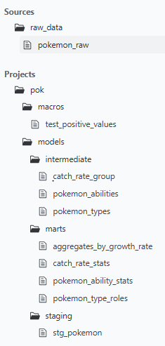
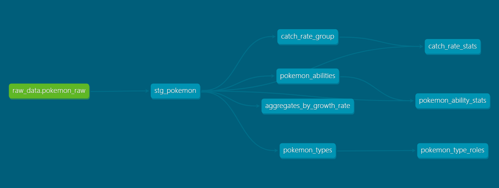
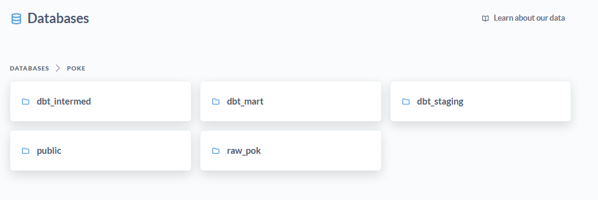

# Pok-mon_ETL

# Table of Contents

1. **[Project Objective](#project-objective)**
2. **[Datasets Selection](#datasets-selection)**
3. **[System Architecture](#system-architecture)**
   - [System Overview](#system-overview)
   - [Data Ingestion](#data-ingestion)
   - [Orchestration](#orchestration)
   - [Data Storage](#data-storage)
   - [Data Process](#data-process)
   - [Data Visualization](#data-visualization)
4. **[Technologies Used](#technologies-used)**
5. **[Running the Project](#running-the-project)**
6. **[What's Next](#whats-next)**

# Project Objective
The project aims to build data pipeline using Airflow and dbt to extract, load, and transform Pokémon data into a PostgreSQL data warehouse. The project enables automated ingestion, cleaning, and modeling of the data to support analytics and reporting.

# Datasets Selection


## Pokémon API
- Source: [Pokémon API](https://pokeapi.co/)
- This is open-source RESTful API containes All the Pokémon data like Moves, Abilities Pokémon, Types, etc


# System Architecture
## System Overview
The system is divided into several components, each responsible for specific tasks within the data process:
<center>
      
</center>

## Data Ingestion:
- **Extraction** raw Pokémon data from an external API using Python script sends HTTP requests to the api.
- Data then saved locally as a `.csv`.
# Orchestration:
- **Astronomer** is used for Apache Airflow
- A custom DAG build to automates the workflow: it extracts data from an API, saves it as a CSV, loads it into Postgres, triggers DBT for transformations, and runs data quality tests.
# Data Storage:
- **PostgreSQL** acts as the main storage layer.
- The raw extracted is inserted into the `staging.pokemon_raw`.
# Data Process:
**DBT** models are defined in layers:
- **Staging Layer**: containes the raw data after renames columns.
- **Intermediate Layer**: Normalizing and cleaning the data by Create tables for analysis.
- **Marts Layer**: Produces aggregated tables ready for visualization.
- **Data Quality**: Create `schema.yml` in DBT’s for testing.

# Data Visualization:
- **Metabase** used for visualization and answer question.

# Technologies Used:
## Environment:
- **Github Codespace**: Used to set up the Development environment.
- **Docker**: Containerizes the system component.
## Frameworks and Tools:
- **Astro:** Utilizes Astro (built on Airflow) for orchestrating the data pipeline.
- **DBT:** Handles data transformation.
- **Postgres:** Storage the relational database. raw, staged, and aggregated Pokémon data.
- **Metabase:** visualizing insights from marts tables.

# Running the Project
**1. Clone the Repository**
- Clone and Navigate to the project directory:
   ```
   git clone https://github.com/FA3001/Poke_ETL.git
   cd Poke_ETL
   ```
**2. Install the Astro CLI**
- Setting up Astro and starting the project.
   ```
   chmod +x start.sh
   ./start.sh
   ```
**3.Access Airflow's web UI**
- Access the ui on the port
   ```
   http://127.0.0.1:8080/ 
   ```
**4.Connect to Postgres:**
- In the airflow ui go to connection and choose **Add Connection**.
- Enter the Postgres detailes as in the `profiles.yml` and give it id `postgres_conn`

**5.Run the Dag:**
- Open **POK_DAG** dag and trigger it.
- This will run multible tasks.
- `extract_pokemon_data` task will run the python file `extract_pokemon_api.py` and save the csv file in data folder in airflow container.
- `create_table` task will create the raw table `raw_pok.pokemon_raw`
- `load_to_postgres` task loads the csv to the postgres table we created.
- `dbt_tasks` task group executes all dbt models in sequence, creating views and tables across the staging, intermediate, and marts layers.

- `dbt_test` task runs all data tests defined in the `schema.yml` files within the dbt project to validate data quality.
   <center>
         
   </center>

- **DBT Docs:** You can generate the docs using:
   ```
   dbt docs serve --port 8088 --host 0.0.0.0 --project-dir /usr/local/airflow/dags/pok --profiles-dir /usr/local/airflow/dags
   ```
- This will open dbt Docs UI and you can see every thing in the project.

   <center>
         
   </center>

- Lineage Graph.

   <center>
         
   </center>


**6.Metabase**
- Access Metabase UI on port:
   ```
   http://127.0.0.1:3000/
   ```
- Enter Sing up detailes.
- In **Add a database** Choose the postgres and complete the detailes.
- Go to **Databases** and go to `mart` schema.
- Now you can see the `mart` tables.
   
   <center>
         
   </center>
- **You can create visualization from the mart tables** click on `New` then `_SQL query`.
- How many times does each type appear as primary and secondary?

   <center>
         
   </center>
- What is the average total stats and HP by catch rate group?
   <center>
         
   </center>


# What's Next
- **Expand Data Sources:** Extract more data to include more attributes like moves, evolutions.
- **CI/CD Integration:** Set up GitHub Actions to automate testing.
- **Enhanced Visualizations:** Create interactive dashboard with filters and more.
